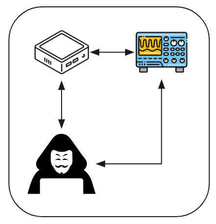
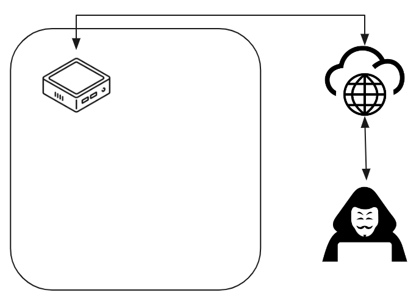
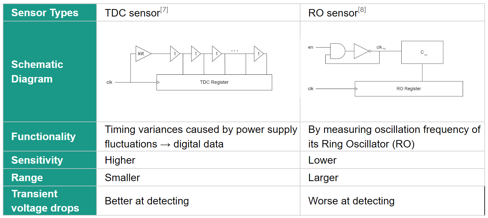
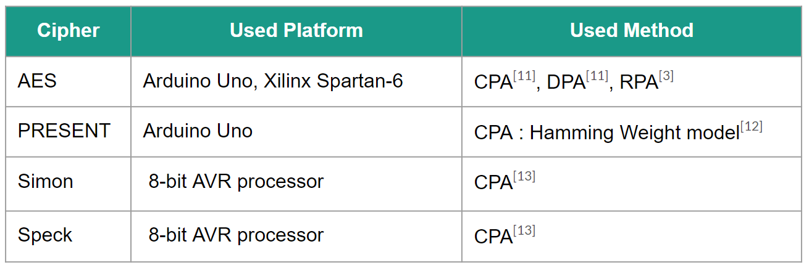
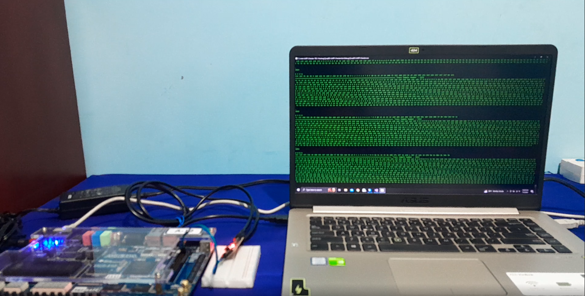
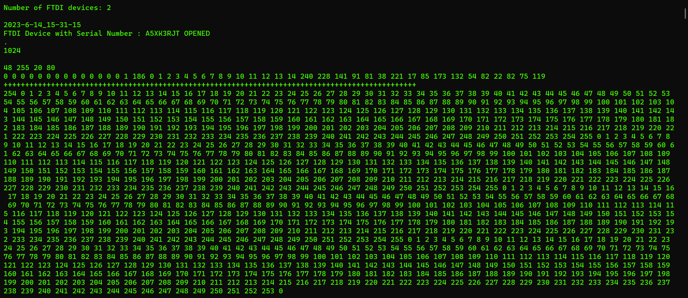
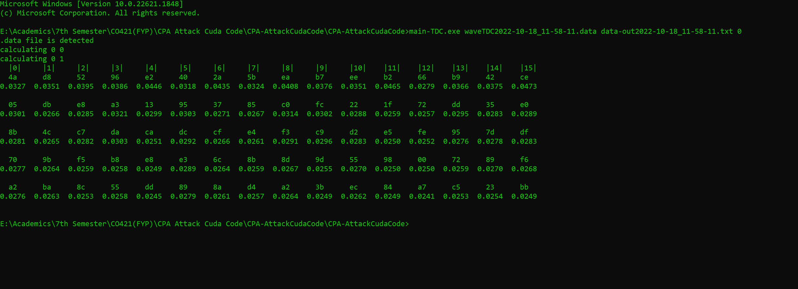

[comment]: # "This is the standard layout for the project, but you can clean this and use your own template"

# Investigating On-chip sensor based RPA Attack Vulnerabilities of Light-weight Ciphers

#### Team

- E/17/027, Pubudu Bandara, [email](mailto:e17027@eng.pdn.ac.lk)
- E/17/176, Esara Sithumal, [email](mailto:e17176@eng.pdn.ac.lk)
- E/17/219, Ishara Navarathna, [email](mailto:e17219@eng.pdn.ac.lk)

#### Supervisors

- Dr. Damayanthi Herath, [email](mailto:damayanthiherath@eng.pdn.ac.lk)
- Dr. Mahanama Wickramasinghe, [email](mailto:mahanamaw@eng.pdn.ac.lk)
- Dr. Darshana Jayasinghe, [email](mailto:darshana.jayasinghe@gmail.com)

#### Table of content

1. [Abstract](#abstract)
2. [Related works](#related-works)
3. [Methodology](#methodology)
4. [Experiment Setup and Implementation](#experiment-setup-and-implementation)
5. [Results and Analysis](#results-and-analysis)
6. [Conclusion](#conclusion)
7. [Publications](#publications)
8. [Links](#links)

---

<!-- DELETE THIS SAMPLE before publishing to GitHub Pages !!!
This is a sample image, to show how to add images to your page. To learn more options, please refer [this](https://projects.ce.pdn.ac.lk/docs/faq/how-to-add-an-image/)
 -->

## Abstract
Side channel attacks exploit factors like power consumption, timing information, and defective computations to extract sensitive information from cryptographic systems. Techniques such as Correlation Power Analysis (CPA) and Differential Power Analysis (DPA) are commonly used in these attacks. The correlation between power consumption and the Hamming Distance is important in side channel analysis. Cryptographic algorithms like AES, ECC, and RSA are vulnerable to power analysis attacks despite being considered secure. Field-Programmable Gate Arrays (FPGAs) are flexible hardware devices commonly used in cryptography, but their parallel nature can lead to unintended side channel leakage. On-chip voltage sensors are employed to monitor power fluctuations and detect potential issues. FPGA-based side channel attacks can occur in various scenarios and require effective countermeasures. Machine learning techniques have been successful in extracting sensitive information from side channels, enabling accurate prediction of secret information. Lightweight ciphers used in IoT devices, such as Simon and PRESENT, are efficient but vulnerable, necessitating the identification of vulnerabilities and implementation of countermeasures.

## Related works
### Correlation Power Analysis (CPA)

     
    <i>Figure 01: Overview of Correlation Power Analysis (CPA)</i>

Correlation Power Analysis (CPA) is a highly effective technique utilized in side channel attacks, aiming to extract sensitive information from cryptographic devices. It capitalizes on the correlation observed between power consumption and specific data characteristics, such as the Hamming Weight or the Hamming Distance. By identifying the parameters of the leakage model, CPA enables a thorough investigation into the significance of the Hamming Distance and its potential in revealing secret information.

In the realm of side channel attacks, various methods exist for uncovering secrets, with Differential Power Analysis (DPA) and the correlation between power consumption and the Hamming Weight being prominent techniques. However, this approach emphasizes the application of the Hamming Distance and the leakage model, leveraging CPA as the primary analytical tool. The primary objective is to delve deeper into the importance of the Hamming Distance and assess its effectiveness in extracting sensitive information.

The Hamming Distance and the Hamming Weight are closely interconnected concepts within the context of binary sequences or strings. The Hamming Distance quantifies the number of bit positions that differ during transitions from one state to another, while the Hamming Weight represents the count of '1' bits in the current state. These concepts provide valuable insights into the dissimilarity and the necessary transformations between different binary strings.

Through monitoring power measurements during cryptographic operations, it becomes possible to infer the transitions occurring within the device and deduce the corresponding Hamming Distance. Power variations observed during these transitions serve as a side channel through which information about the underlying data can be extracted, potentially leading to the disclosure of secret keys.

Previous research has made crucial assumptions supporting a linear relationship between the Hamming Distance and power consumption. These assumptions establish a foundation for analyzing information leakage through power measurements, enabling the estimation of the Hamming Distance based on observed power variations. Consequently, this facilitates the extraction of sensitive information using side channel analysis techniques.

### Remote Power Analysis (RPA)

     
    <i>Figure 02: Overview of Remote Power Analysis (RPA)</i>

Remote Power Analysis (RPA) is a technique used in side channel attacks to extract sensitive information from a target cryptographic device without physical access. It involves analyzing power consumption patterns remotely by measuring the device's electromagnetic emissions or power fluctuations. RPA allows attackers to gather insights into the device's internal operations and potentially extract valuable data.

Correlation Power Analysis (CPA) is a specific methodology within side channel attacks that focuses on analyzing the correlation between power consumption and the device's data characteristics. It aims to uncover patterns in power consumption that align with specific data values or cryptographic operations. CPA enables the inference of sensitive information, such as cryptographic keys, by measuring power consumption during cryptographic operations.

RPA and CPA are related in their goal of extracting information through power analysis. While RPA acquires power consumption data remotely, without physical contact with the device, CPA assumes direct access to the device's power supply. RPA provides a means of remotely gathering power consumption data, and this data can then be subjected to CPA techniques for analysis.

By combining RPA and CPA, attackers can overcome physical barriers and extract sensitive information remotely. RPA allows for the remote acquisition of power measurements, while CPA enables sophisticated analysis techniques to identify correlations and extract valuable secrets. This combination offers a powerful strategy for side channel attacks, expanding the possibilities of extracting information without physical proximity to the target device.

### On-chip Sensors
On-chip sensors can play a role in side-channel attacks by providing additional sources of information that can be exploited to extract sensitive data. Side-channel attacks aim to uncover secret information, such as encryption keys, by analyzing unintended information leakage during the operation of a cryptographic device. While on-chip sensors are not specific to side-channel attacks, they can potentially be leveraged as additional side channels for extracting information. Followings are some comparisons between them:

     
    <i>Figure 03: Comparison of On-chip Sensors</i>

### Previous Work

     
    <i>Figure 04: Previous experiments done against some Ciphers</i>

## Methodology
- Getting the Power Traces
  - Do the hardware implementation of lightweight ciphers using verilog.
    - PRESENT
    - SIMON
    - SPECK
  - The cipher runs on a Altera DE2 FPGA:
    - Known plaintext values are used for encryption purposes
    - The same key is used in every encryption
  - Each time the FPGA encrypts a given plaintext:
    - Developed internal sensor (RO or TDC) on same FPGA captures the waveform
    - Each instance of captured waveform corresponding to a known plaintext consists of constant number of sampling points 
  - Captured waveforms along with the relevant ciphertext, plaintext, and key are transmitted to a PC

- Handling data at PC end
  - Following data is written to a three separate text files:
    - Generated ciphertexts
    - Used plaintexts
    - Secret key
  - The power trace for each encryption operation is written to a binary file (.data)

- Executing the attack
  - Captured data is used to perform a CPA attack
  - PRESENT cipher
    - Hamming Distance model: to model the power consumption for each key guess
    - Modeled power consumptions are compared with the observed power consumption using linear correlation analysis
    - Target: S-box operation
  - SIMON cipher
    - Target: Bitwise AND operation
    - The same hamming distance model can be used
  - SPECK cipher
    - Target: modular subtraction
    - The same hamming distance model can be used

- Evaluating Results
  - Using the Success Rate.
  - Success Rate can be used,
      - Execute attack n times using same data
      - Count successful guesses
      - Success Rate =  (Number of Successful Attacks / Total Number of Attacks) * 100

## Experiment Setup and Implementation
- Experimental Setup

- Output of the hardware setup (Powertrace Output):

- Output of the CPA attack (Using Cuda):

## Results and Analysis

## Conclusion

## Publications
[//]: # "Note: Uncomment each once you uploaded the files to the repository"

1. [Semester 7 report](./data/Investigating-Onchip-Sensor-Based-RPA-Attack-Vulnerabilities-of-Light-Weight-Ciphers-Liteture-Review.pdf)
<!-- 2. [Semester 7 slides](./) -->
<!-- 3. [Semester 8 report](./) -->
<!-- 4. [Semester 8 slides](./) -->
<!-- 5. Author 1, Author 2 and Author 3 "Research paper title" (2021). [PDF](./). -->

## Links

[//]: # ( NOTE: EDIT THIS LINKS WITH YOUR REPO DETAILS )

- [Project Repository](https://github.com/cepdnaclk/e17-4yp-Investigating-Onchip-Sensor-Based-RPA-Attack-Vulnerabilities-of-Light-Weight-Ciphers)
- [Project Page](https://cepdnaclk.github.io/e17-4yp-Investigating-Onchip-Sensor-Based-RPA-Attack-Vulnerabilities-of-Light-Weight-Ciphers/)
- [Department of Computer Engineering](http://www.ce.pdn.ac.lk/)
- [University of Peradeniya](https://eng.pdn.ac.lk/)

[//]: # "Please refer this to learn more about Markdown syntax"
[//]: # "https://github.com/adam-p/markdown-here/wiki/Markdown-Cheatsheet"
